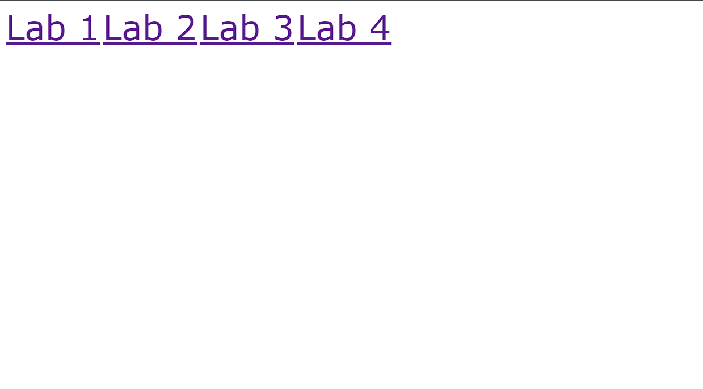

# Web Programming Lab Works Repository

This repository contains the source code for various lab works related to Web programming.

## Repository Structure

The repository is organized into different lab folders:
- [lab_1](lab_1/)
- [lab_2](lab_2/)
- [lab_3](lab_3/)
- [lab_4](lab_4/)
- [lab_5](lab_5/)
- [lab_6](lab_6/)

## Getting started

To access all labs in one place, visit the [https://smoklien.github.io/](https://smoklien.github.io/) website.

## Site Preview

