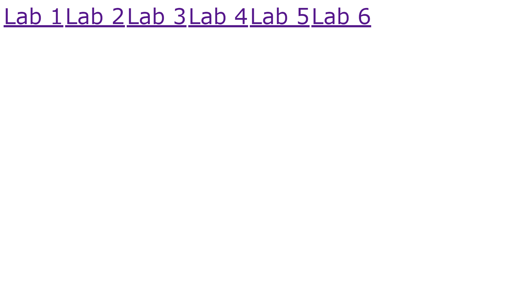

# Web Programming Lab Works Repository

This repository contains the source code for various lab works related to Web programming.

## Repository Structure

- `lab`: Source code and related files to the labs.
- `index.html`: Main page with links to all labs.
- `index-preview.png`: Main page image preview.
- `.gitignore`: Files or folders to ignore.

## Getting started
  
To access all labs in one place, visit next website [https://smoklien.github.io/](https://smoklien.github.io/).

## Site Preview

